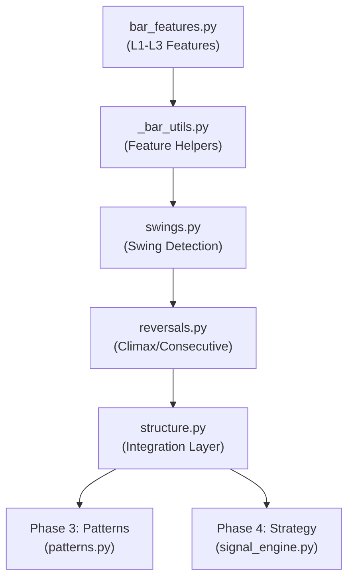

# Al Brooks Price Action System - Development Roadmap

This document outlines the strategic progression from basic feature extraction to a fully actionable trading analysis system.

## Phase 1: Micro-Analysis (Bar Features) [Current]
**Goal**: Quantify the immediate properties of specific bars. "The Atoms of Price Action"
*   **Module**: `src/analysis/bar_features.py`
*   **Status**: 100% Complete (Legacy logic unified).

### 1.1 Single-Bar Features (The Physics)
*   **Scope**: N=1 (Internal properties).
*   **Status**: [Done]
*   **Deliverables**:
    *   [x] **L1 Scale**: Body Size, Range, Climax Detection.
    *   [x] **L2 Shape**: Doji, Pinbar, Bar Color.
    *   [x] **L3 Signal**: Strong Reversal Bars (Brooks Definition).

### 1.2 Dual-Bar Features (The Interaction)
*   **Scope**: N=2 (Relationship with immediate predecessor).
*   **Status**: [Done]
*   **Deliverables**:
    *   [x] **Gaps**: Body Gap, True Gap.
    *   [x] **Patterns**: Engulfing, Outside Bars, Inside Bars.
    *   [x] **Blended**: Virtual single bar analysis of 2 bars.
    *   [x] **Traps**: Failed Breakouts.

### 1.3 Multi-Bar Features (The Context)
*   **Scope**: N > 2 (Rolling window / Indicator relations).
*   **Status**: [In Progress]
*   **Deliverables**:
    *   [x] **P0: EMA Gravity**: Distance to EMA, Gap Bars, Magnetic Pull.
    *   [x] **Trend Streak**: Consecutive trend bars.
    *   [x] **P1: Volatility**: ATR-based normalization (Implemented in prompt guidelines).

## Phase 2: The Map (Market Structure) [Current]
**Goal**: Identify the "Terrain" where the battle is fighting. "Where are we?"
*   **Module**: `src/analysis/structure.py` (New)
*   **Status**: 95% Complete (Refactoring complete, core logic verified).
*   **Key Concepts**:
    1.  **Swing Points (V2)**: 
        *   **Status**: [Done]
        *   **Implementation**: `swings.py` (374 lines) with Breakout Confirmation logic.
    2.  **Reversal Detection**:
        *   **Status**: [Done]
        *   **Climax Reversal**: `reversals.py` (289 lines) V-Top/Bottom detection.
        *   **Consecutive Reversal**: `reversals.py` (289 lines) gradual reversal.
    3.  **Integration Layer**:
        *   **Status**: [Done]
        *   **Implementation**: `structure.py` (175 lines) orchestrates swings and reversals.
    4.  **Always In / Trend State**:
        *   **Status**: [Done]
        *   **Implementation**: Computed in `structure.py`.

## Phase 3: The Setup (Pattern Recognition)
**Goal**: Identify specific tactical opportunities within the structure. "Is there an entry?"
*   **Module**: `src/analysis/patterns.py` (New)
*   **Key Concepts**:
    1.  **Pullback Counting**: The Holy Grail of Brooks trend trading.
        *   H1/H2 (Bull Trend Pullbacks).
        *   L1/L2 (Bear Trend Pullbacks).
    2.  **Geometry**:
        *   Wedges (3-push patterns).
        *   Trendline Breaks & Retests.
    3.  **Spike & Channel**: Identifying the transition from impulse to oscillation.

## Phase 4: The Strategy (Decision Engine)
**Goal**: Synthesize Context + Signal for execution. "Should I take this trade?"
*   **Module**: `src/strategy/signal_engine.py` (New)
*   **Key Concepts**:
    1.  **Context Scoring**: Weighting `Trend_Strength` + `Support_Location` + `Setup_Quality`.
    2.  **Trap Filters**: "Good Signal Bar at Bad Location" detection (e.g., buying a Bull Reversal at the top of a Trading Range).
    3.  **Trade Management**:
        *   Stop Loss placement (Swing point vs. Signal bar extreme).
        *   Profit Targets (Scalp vs. Swing).

---

## Technical Dependency Graph

## 模块组织 (As of v0.2.0)

### Analysis Layer (src/analysis/)

| 模块 | 职责 | 行数 | 依赖 |
|------|------|------|------|
| bar_features.py | 单根K线特征提取 | 267 | _bar_utils, indicators |
| _bar_utils.py | 特征计算辅助函数 | 80 | pandas, numpy |
| swings.py | Swing High/Low检测 | 374 | pandas, _structure_utils |
| reversals.py | 反转模式识别 | 289 | pandas, _structure_utils |
| structure.py | 市场结构集成层 | 175 | swings, reversals |
| _structure_utils.py | 常量和工具函数 | 72 | numpy |

### I/O Layer (src/io/)

| 模块 | 职责 | 行数 |
|------|------|------|
| loader.py | 统一加载接口 | - |
| config_loader.py | 配置读取 | 60 |
| file_discovery.py | 文件扫描和选择 | 158 |
| adapters/ | 多源数据适配 | - |

### Entry Points (根目录)

| 脚本 | 职责 | 行数 |
|------|------|------|
| run_pipeline.py | 主分析流水线 | 129 |
| fetch_data.py | 数据获取脚本 | - |

