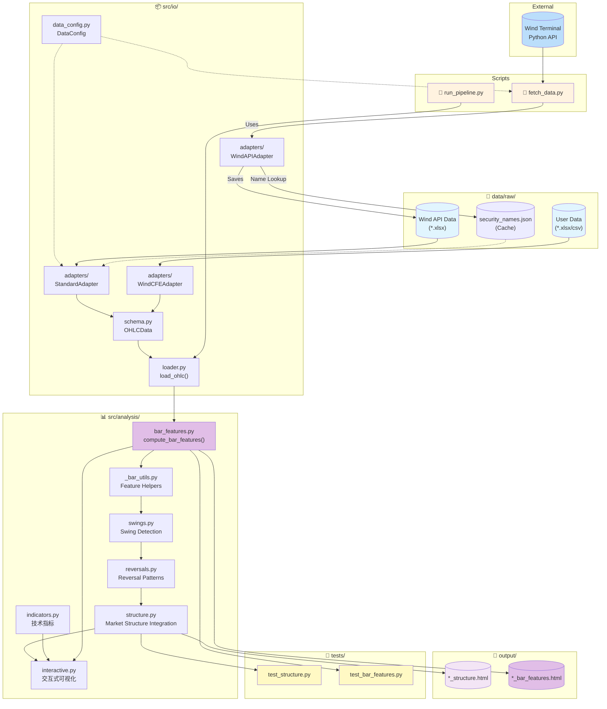
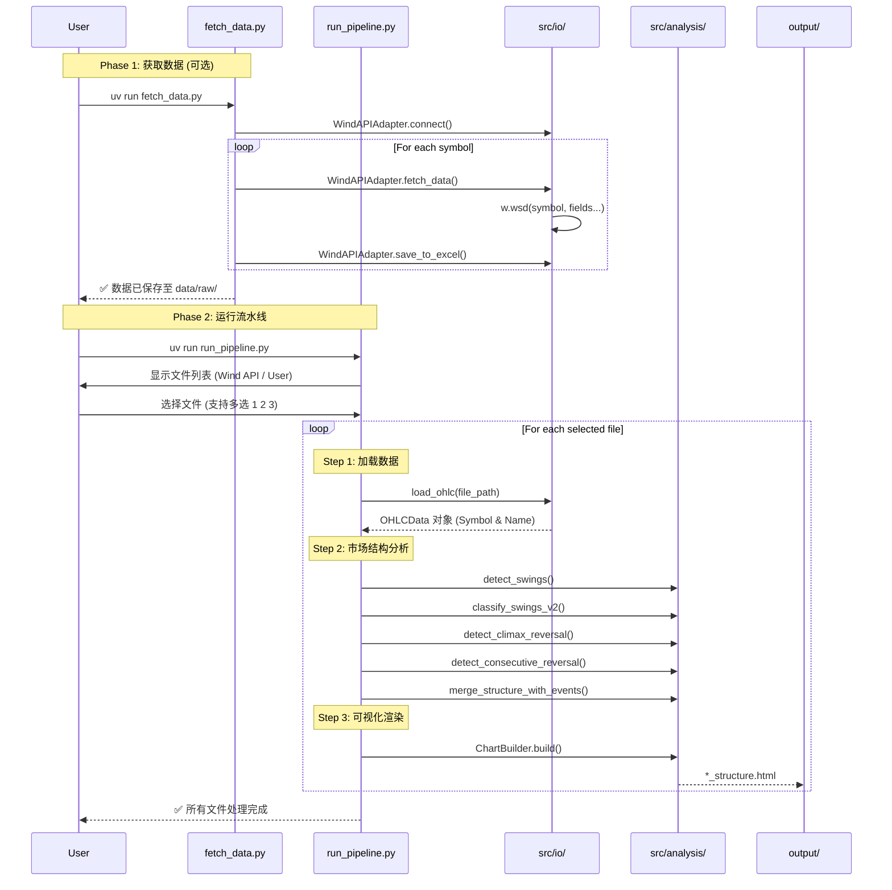
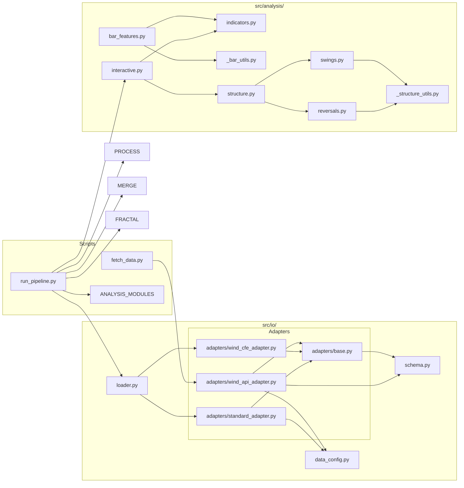

# K 线分析流水线 - 代码工作流

## 整体架构

## 数据获取与分析流程

## 模块依赖关系

## 数据转换流程

| 阶段 | 输入 | 下游/适配器 | 输出 | 说明 |
|------|------|-------------|------|------|
| **获取** | Wind Terminal | `WindAPIAdapter` | `*.xlsx` (Standard) | 自动解析名称并缓存至 `security_names.json` |
| **加载** | xlsx/csv | `StandardAdapter` | `OHLCData` | 优先读取缓存名称，**自动填充缺失的 open 列** |
| **特征提取** | `OHLCData` | `bar_features` | 特征 Series | 提取 PA 特征 (含 Urgency, Buying/Selling Pressure) |
| **Swing 检测** | `OHLCData` | `swings` | Swing Points | 识别 Major Swing High/Low (V2/V3) |
| **反转识别** | Swing Data | `reversals` | Reversal Events | 识别 Climax 和 Consecutive 反转模式 |
| **结构集成** | 多源数据 | `structure` | Market Structure | 集成 Swing、Reversal 和 Trend 状态 |
| **可视化** | Structure Data | `interactive` | `*_structure.html` | 生成交互式市场结构图表 |

## 已知限制

| 品种 | 问题 | 解决方案 |
|------|------|----------|

