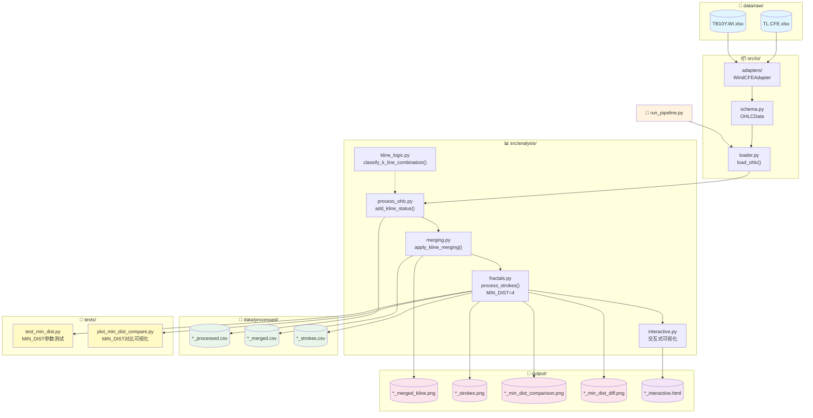
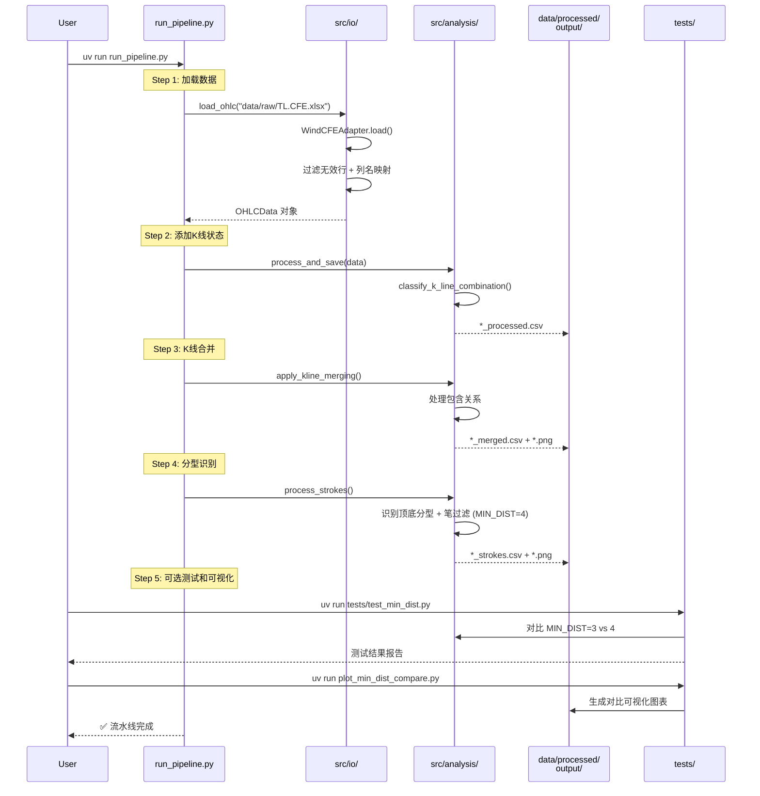
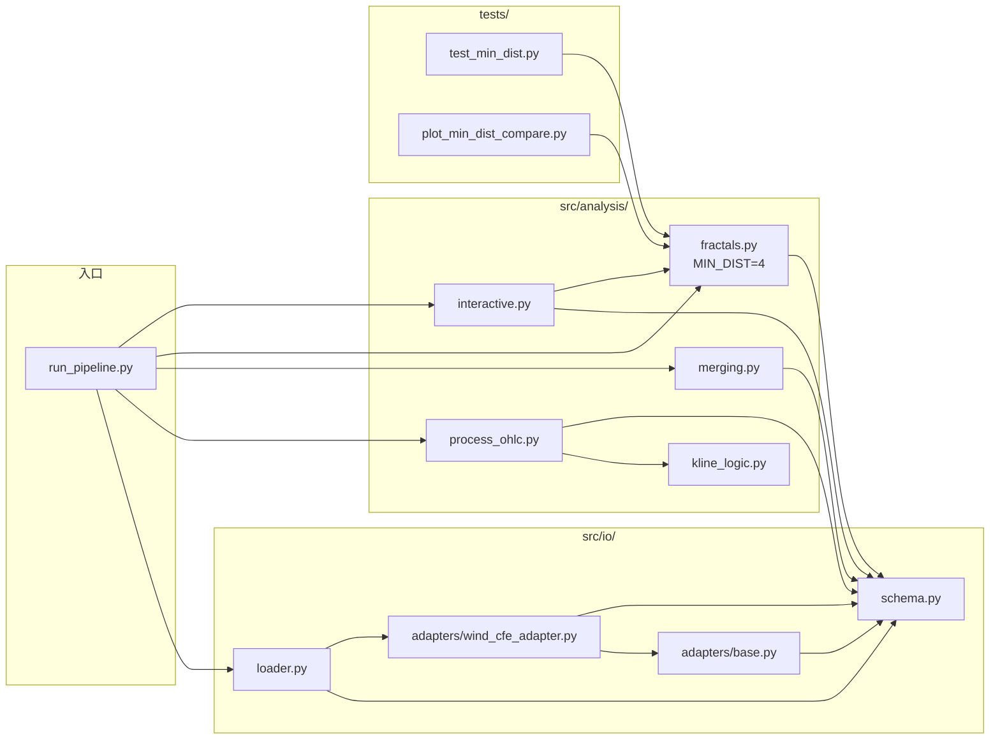

# K 线分析流水线 - 代码工作流

## 整体架构



## Pipeline 执行流程



## 模块依赖关系



## 数据转换流程

| 阶段 | 输入 | 处理 | 输出 |
|------|------|------|------|
| **加载** | xlsx/csv (Wind格式) | 过滤脏数据 + 列名标准化 | `OHLCData` 对象 |
| **状态标记** | `OHLCData` | 分类相邻K线关系 | `*_processed.csv` |
| **合并** | processed.csv | 处理包含关系 | `*_merged.csv` + 图 |
| **分型** | merged.csv | 识别顶底 + 笔过滤 (MIN_DIST=4) | `*_strokes.csv` + 图 |

## MIN_DIST 参数说明

### 参数定义

在 `src/analysis/fractals.py` 中定义：

```python
MIN_DIST = 4  # 顶底分型中间K线索引差至少为4（即中间隔3根，总共7根K线，不共用）
```

### 参数影响

| 数据源 | MIN_DIST=3 | MIN_DIST=4 | 含笔验证 | 变化 |
|--------|-----------|-----------|----------|------|
| TL.CFE | 65 笔 | 53 笔 | - | -18.5% |
| TB10Y.WI | 164 笔 | 114 笔 | 73 笔 | -55% |

### MIN_DIST=4 的优势

- **减少噪音**：过滤更多短期波动，识别更稳定的趋势
- **提高质量**：确保笔之间有足够的间隔，避免过度敏感
- **符合缠论**：更接近缠论中关于笔的定义要求

---

## 笔过滤算法详解

### 核心逻辑

1. **分型识别**：纯3根K线组合判断（中间K线的 high/low 比左右都高/低）
2. **距离约束**：相邻笔端点间隔 >= MIN_DIST
3. **极值更新**：同向分型取极值更优者
4. **笔有效性验证**：确保笔终点是区间内真正的极值

### 笔有效性验证

当确认一笔时，检查从起点到终点的区间内：
- TOP：区间内是否有更高的 high
- BOTTOM：区间内是否有更低的 low

如果存在更极端的价格，说明当前分型不是真正的极值点，这一笔无效。

**回溯策略**：只回溯一层，取消上一个笔端点，直接确认当前分型为新端点，避免级联取消。

### 被替换分型 (Tx/Bx)

在图表中用灰色标记显示被替换的分型：
- **Tx**：因距离不足或极值比较被替换的顶分型
- **Bx**：因距离不足或极值比较被替换的底分型

---

## 测试和对比

项目提供了测试和可视化工具来对比不同 MIN_DIST 值的效果：

```bash
# 运行 MIN_DIST 参数测试
uv run tests/test_min_dist.py

# 生成 MIN_DIST 对比可视化
uv run plot_min_dist_compare.py
```

### 支持的数据源

项目支持多个数据源的分析：

- **TL.CFE**：中国金融期货交易所数据
- **TB10Y.WI**：10年期国债收益率数据

每个数据源独立处理，生成对应的处理结果和可视化图表。

---

## 交互式图表功能

### 显示内容

- **K线蜡烛图**：标准 OHLC 显示
- **技术指标**：EMA20（橙色线）
- **笔连线**：紫色线连接有效分型
- **分型标记**：T/B（有效）、Tx/Bx（被替换）

### 交互功能

- **缩放**：鼠标滚轮，以鼠标位置为中心
- **平移**：左键拖动
- **OHLC 面板**：左上角固定显示日期、OHLC、涨跌幅、指标值
- **Crosshair**：十字线跟踪鼠标位置
